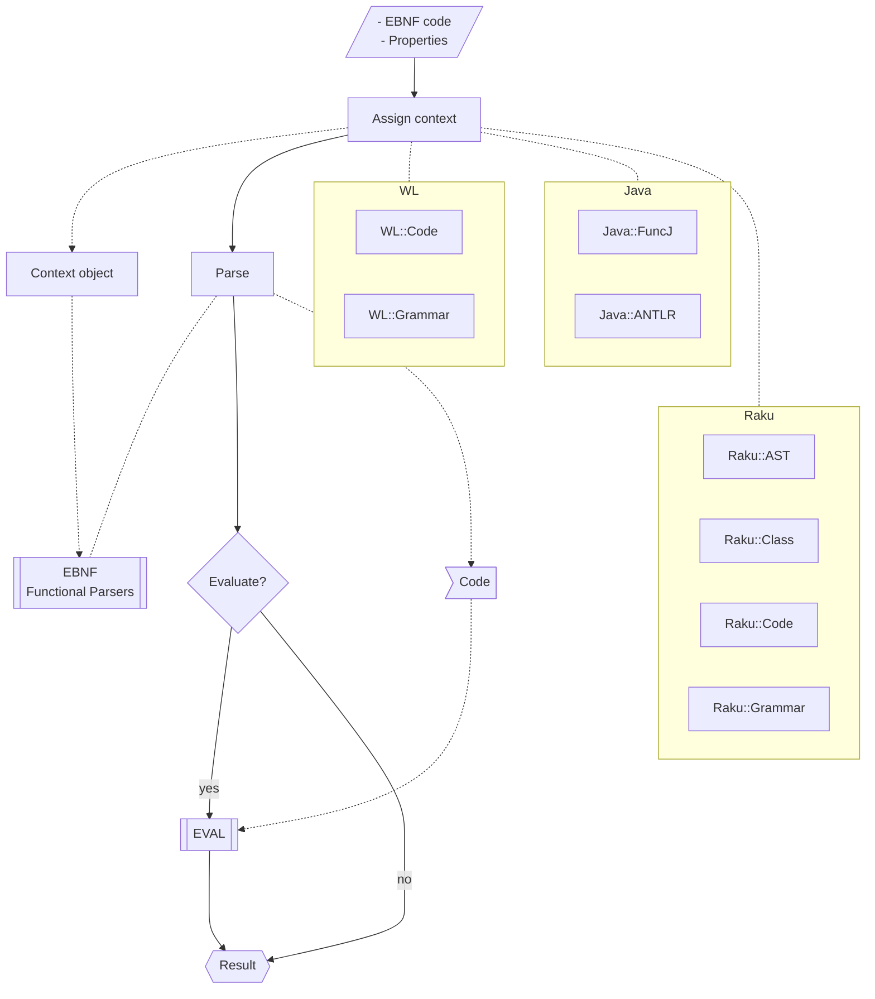

# FunctionalParsers Raku package

## Introduction

This Raku package provides a (monadic) system of Functional Parsers (FPs).

The package design and implementation follow closely the article "Functional parsers" by Jeroen Fokker, [JF1].
That article can be used as *both* a theoretical- and a practical guide to FPs. 

### Two in one

The package provides both FPs and 
[Extended Backus-Naur Form (EBNF)](https://en.wikipedia.org/wiki/Extended_Backus–Naur_form) 
parsers and interpreters.
The reasons for including the EBNF functionalities are:

- EBNF parsing is discussed in [JF1]
- EBNF parsers and interpreters are very good examples of FPs application

### Previous work

#### Anton Antonov

- FPs packages implementations in Lua, Mathematica, and R. 
  See [these blog posts](https://mathematicaforprediction.wordpress.com/?s=functional+parsers) and [AAp1, AAp2].

**Remark:** In this document Mathematica and Wolfram Language (WL) are used as synonyms.

#### Jeroen Fokker

- "Functional parsers" article using Haskell, [JF1].

#### Wim Vanderbauwhede

- Interesting and insightful blog post ["List-based parser combinators in Haskell and Raku"](https://limited.systems/articles/list-based-parser-combinators/).
   
    - The corresponding Raku code repository [WVp1] is not (fully) productized.

- Perl package ["Parser::Combinators"](https://github.com/wimvanderbauwhede/Perl-Parser-Combinators), [WVp2].

------

## Installation

From [Zef ecosystem](https://raku.land):

```
zef install FunctionalParsers;
```

From GitHub:

```
zef install https://github.com/antononcube/Raku-FunctionalParsers.git
```

------

## Motivation

Here is a list of motivations for implementing this package:

1. Word-based backtracking
2. Elevate the "tyranny" of Raku grammars
3. Easier transfer of Raku grammars into other languages
4. Monadic parser construction 
5. Quick, elegant implementation


### Word-based backtracking

I had certain assumptions about certain slow parsing with Raku using regexes. 
For example, is not that easy to specify backtracking over sequences of words (instead of characters) in grammars.
To check my assumptions I wrote the basic eight FPs (which is quick to do.) After my experiments,
I could not help myself making a complete package.

### Elevate the "tyranny" of Raku grammars and transferring to other languages

The "first class citizen" treatment of grammars is one of the most important and unique features of Raku. 
It is one of the reason why I treat Raku as a "secret weapon." 

But that uniqueness does not necessarily facilitate easy utilization or transfer in large software systems.
FPs, on the other hand, are implemented in almost every programming language. 
Hence, making or translating grammars with- or to FPs would provide greater knowledge transfer and integration
of Raku-derived solutions.

### Monadic parser construction

Having a monadic way of building parsers or grammars is very appealing. (To some people.)
Raku's operator making abilities can be nicely utilized.

**Remark:** The monad of FPs produces Abstract Syntax Trees (ASTs) that are simple lists.
I prefer that instead of using specially defined types (as, say, in [WV1, WVp1].) That probably,
comes from too much usage of LISP-family programming languages. (Like Mathematica and R.)

### Quick, elegant implementation

The Raku code implementing FPs was quick to write and looks concise and elegant.

(To me at least. I would not be surprised if that code can be simplified further.)

------

## Naming considerations

### Package name

I considered names like "Parser::Combinator", "Parser::Functional", etc. Of course, looked up
names of similar packages.

Ultimately, I decided to use "FunctionalParsers" because:

- Descriptive name that corresponds to the title of the article by Jeroen Fokker, [JF1].
- The package has not only parser combinators, but also parser transformers and modifiers.
- The connections with corresponding packages in other languages are going to be more obvious.
  - For example, I have used the name "FunctionalParsers" for similar packages in other programming languages (Lua, R, WL.)

### Actions vs Contexts

I considered to name the directory with EBNF interpreters "Context" or "Contexts", but 
since "Actions" is used a lot I chose that name.

**Remark:** In [JF1] the term "contexts" is used.

------

## Examples

Make a parser for a family of (two) simple sentences:

```perl6
use FunctionalParsers :ALL;

my &p1 = (symbol('numerical') «|» symbol('symbolic')) «&» symbol('integration');
```

Here we parse sentences adhering to the grammar of the defined parser:

```perl6
.say for ("numerical integration", "symbolic integration")>>.words.map({ $_ => &p1($_)});
```

These sentences are not parsed:

```perl6
("numeric integration", "symbolic summation")>>.words.map({ $_ => &p1($_)});
```

------

## Infix operators

Several notation alternatives are considered for the infix operations corresponding to
the different combinators and transformers. Here is a table with different notation styles:

| Description              | set  | double | n-ary |
|--------------------------|------|--------|-----|
| sequential combination   | (&)  | «&»    | ⨂   |
| left sequential pick     | (<&) | «&     | ◁   |
| right sequential pick    | (&>) | &»     | ▷   |
| alternatives combination | (⎸)  | «⎸»    | ⨁   |
| function application     | (^)  | «o     | ⨀   |

Consider the parsers:

```perl6
my &p1 = apply( {1}, symbol('one'));
my &p2 = apply( {2}, symbol('two'));
my &p3 = apply( {3}, symbol('three'));
my &p4 = apply( {4}, symbol('four'));
my &pM = symbol('million');
my &pTh = symbol('things');
```

Here are spec examples for each style of infix operators:

```perl6
# set
my &p = (&p1 (|) &p2 (|) &p3 (|) &p4) (&) (&pM (^) {10**6}) (&) &pTh;
&p('three million things'.words.List).head.tail;
```

```
# double 
(&p1 «|» &p2 «|» &p3 «|» &p4) «&» &pM «o {10**6} «&» &pTh;
```

```
# n-ary
(&p1 ⨁ &p2 ⨁ &p3 ⨁ &p4) ⨂ {10**6} ⨀ &pM ⨂ &pTh
```

**Remark:** The arguments of the apply operator `⨀` are "reversed" when compared to the arguments of the operators `(^)` and `«o`. 
For `⨀` the function to be applied is the first argument. 

------

## Parser generation

Here is an EBNF grammar:

```perl6
my $ebnfCode = q:to/END/;
<digit> = '0' | '1' | '2' | '3' | '4' | '5' | '6' | '7' | '8' | '9' ;
<integer> = <digit> , { <digit> } ;
<top> = <integer> ;
END
```

Here generation is the corresponding functional parsers code:

```perl6
use FunctionalParsers::EBNF;
.say for fp-ebnf-parse($ebnfCode, actions => 'Raku::Code').head.tail;
```

For more detailed examples see ["Parser-code-generation.md"](./doc/Parser-code-generation.md).

------

## Random sentence generation

Here is an EBNF grammar:

```perl6
my $ebnfCode2 = q:to/END/;
<top> = <who> , <verb> , <lang> ;
<who> = 'I' | 'We' ;
<verb> = 'love' | 'hate' | { '♥️' } | '🤮';
<lang> = 'Julia' | 'Perl' | 'Python' | 'R' | 'WL' ; 
END
```

Here is generation of random sentences with the grammar above:

```perl6
.say for random-sentence($ebnfCode2, 12);
```

------

## Generating Mermaid diagrams for EBNFs

The function `fp-ebnf-parse` can produce 
[Mermaid-JS diagrams](https://mermaid.js.org)
corresponding to grammars with the target "MermaidJS::Graph".
Here is an example:

```perl6, result=asis, output-lang=mermaid, output-prompt=NONE
my $ebnfCode3 = q:to/END/;
<top> = <a> | <b> ;
<a> = 'a' , { 'A' } , [ '1' ];
<b> = 'b' , ( 'B' | '2' );
END

fp-ebnf-parse($ebnfCode3, target=>"MermaidJS::Graph", dir-spec => 'LR').head.tail
```

Here is a legend:

- The non-terminals are shown with rectangles 
- The terminals are shown with round rectangles
- The "conjunctions" are shown in disks 

**Remark:** The Markdown cell above has the parameters `result=asis, output-lang=mermaid, output-prompt=NONE`
which allow for direct diagram rendering of the obtained Mermaid code in various Markdown viewers (GitHub, IntelliJ, etc.)

Compare the following EBNF grammar and corresponding diagram with the ones above:

```perl6, result=asis, output-lang=mermaid, output-prompt=NONE
my $ebnfCode4 = q:to/END/;
<top> = <a> | <b> ;
<a> = 'a' , { 'A' } , [ '1' ] ;
<b> = 'b' , 'B' | '2' ;
END

fp-ebnf-parse($ebnfCode4, target=>"MermaidJS::Graph", dir-spec => 'LR').head.tail
```

------

## CLI

The package provides a Command Line Interface (CLI) script for parsing EBNF. Here is its usage message:

```shell
fp-ebnf-parse --help
```

If [mermaid-cli](https://github.com/mermaid-js/mermaid-cli) 
is installed here is an example UNIX shell pipeline with it:

```
fp-ebnf-parse ./resources/Arithmetic.ebnf -s=relaxed -t=mermaid > diag.md && mmdc -i diag.md -o diag.png -w 1200 && open diag.png
```

------

## Implementation considerations

### Infix operators

The infix operators have to be reviewed and probably better sets of symbols would be chosen.
The challenge is to select operators that are "respected" by the typical Raku IDEs. 
(I only experimented with Emacs and Comma IDE.)

### EBNF parser

All EBNF parser functions in `FunctionalParsers::EBNF` have apply-transformers that use the attributes of
a dedicated object:

```
unit module FunctionalParsers::EBNF;
...
our $ebnfActions = FunctionalParsers::EBNF::Actions::Raku::AST.new;
....
```

By assigning instances of different classes to `$ebnfActions` we get different parsing interpretations.

### Not having abstract class

Looking at the Raku EBNF interpreter classes it can be easily seen that each can inherit from a common abstract class. 
But since the EBNF parsing methods (or attributes that callables) are approximately a dozen one-liners, 
it seems more convenient to have all class method- and attribute definitions on “one screen.”

### Flowchart



------

## TODO

- [X] TODO Parsing EBNF refactoring & additional features
  - [X] DONE Parse any combination of sequence operators
    - Initially, only these were parsed:
      - `'a' <& 'b' <& 'c' | 'a' &> 'd';`
      - `'a' , 'b' , 'c' | 'a' &> 'd';`
    - These are also parsed:
      - `'a' , 'b' &> 'c'`
      - `'a' <& 'b' &> 'c'`
  - [X] DONE Class-based parsers
    - [X] DONE From characters
    - [X] DONE From tokens
  - [X] DONE Themed parsers
    - [X] DONE Inheritance based implementation
    - [X] DONE "Simpler"
    - [X] DONE ANTLR / G4
    - [X] DONE Whatever
  - [ ] TODO "Named" tokens 
    - [ ] `'_?StringQ'` or `'_String'`
    - [ ] `'_WordString'`, `'_LetterString'`, and `'_IdentifierString'`
    - [ ] `'_?NumberQ'` and `'_?NumericQ'`
    - [ ] `'_Integer'`
    - [ ] `'Range[*from*, *to*]'`
- [ ] TODO Interpreters of EBNF
   - [X] DONE Java 
     - [X] DONE ["funcj.parser"](https://github.com/typemeta/funcj/tree/master/parser)
   - [ ] TODO [GraphViz](https://graphviz.org)
     - [ ] TODO [DOT](https://graphviz.org/doc/info/lang.html)
   - [ ] TODO Scala
     - [ ] TODO built-in
     - [ ] TODO [parsley](https://github.com/j-mie6/parsley) 
   - [ ] MAYBE Python
   - [ ] TODO Raku
     - [X] DONE AST
     - [X] DONE Class
     - [X] DONE Code
     - [X] DONE Grammar
     - [X] DONE MermaidJS
     - [ ] TODO Tokenizer (of character sequences)
     - [ ] Other EBNF styles
   - [ ] TODO WL
     - [X] DONE FunctionalParsers, [AAp1, AAp2]
     - [P] TODO GrammarRules
       - Implemented to a point, not tested in WL.
- [ ] TODO Translators
  - [ ] TODO FPs code into EBNF
  - [X] DONE Raku grammars to FPs
    - See the class "Grammar::TokenProcessing::Actions::EBNF" of the package "Grammar::TokenProcessing".
- [ ] TODO Extensions
  - [X] DONE First-matched alternation
    - The standard `alterations` parser is ["longest alternation"](https://docs.raku.org/language/regexes#Longest_alternation:_|) (in Raku's terms.)
  - [ ] TODO Extra parsers
    - [X] DONE `pInteger`
    - [X] DONE `pNumber`
    - [X] DONE `pWord`
    - [X] DONE `pLetterWord`
    - [X] DONE `pIdentifier`
    - [ ] TODO `pNumberRange`
    - Other?
  - [ ] TODO Zero-width assertions implementation
    - [ ] TODO Lookahead
    - [ ] TODO Lookbehind
- [X] DONE Random sentence generation
  - [X] DONE Basic class code
  - [X] DONE Preventing infinite recursion
  - [X] DONE "Named" tokens interpretation
    - [X] `'_?StringQ'` or `'_String'`
    - [X] `'_WordString'`, `'_LetterString'`, and `'_IdentifierString'`
    - [X] `'_?NumberQ'` and `'_?NumericQ'`
    - [X] `'_Integer'`
    - [X] `'Range[*from*, *to*]'`
- [ ] TODO Documentation
    - [X] DONE README
    - [ ] DONE Parser code generation
        - [ ] TODO Raku
            - [X] DONE Class
            - [ ] TODO Code
            - [X] DONE Grammar
        - [X] DONE WL
            - [X] DONE FunctionalParsers
            - [X] DONE GrammarRules
        - [ ] TODO Java
    - [ ] TODO Random sentences generation
    - [X] TODO Mermaid flowchart
    - [ ] TODO Mermaid class diagram? 
- [ ] TODO Videos
  - [ ] TODO Introduction
  - [ ] TODO TRC-2023 presentation


------

## References

### Articles

[JF1] Jeroen Fokker,
["Function Parsers"](https://www.researchgate.net/publication/2426266_Functional_Parsers), 
(1997),
Conference: Advanced Functional Programming, 
First International Spring School on Advanced Functional Programming Techniques-Tutorial Text.
10.1007/3-540-59451-5_1.

[WV1] Wim Vanderbauwhede,
["List-based parser combinators in Haskell and Raku"](https://limited.systems/articles/list-based-parser-combinators/),
(2020),
[Musings of an Accidental Computing Scientist at codeberg.page](https://wimvanderbauwhede.codeberg.page).

### Packages, paclets, repositories

[AAp1] Anton Antonov,
["FunctionalParsers.m"](https://github.com/antononcube/MathematicaForPrediction/blob/master/FunctionalParsers.m),
(2014),
[MathematicaForPrediction at GitHub](https://github.com/antononcube/MathematicaForPrediction).

[AAp2] Anton Antonov,
["FunctionalParsers" WL paclet](https://resources.wolframcloud.com/PacletRepository/resources/AntonAntonov/FunctionalParsers/),
(2023),
[Wolfram Language Paclet Repository](https://resources.wolframcloud.com/PacletRepository/).

[WVp1] Wim Vanderbauwhede,
[List-based parser combinator library in Raku](https://github.com/wimvanderbauwhede/list-based-combinators-raku),
(2020),
[GitHub/wimvanderbauwhede](https://github.com/wimvanderbauwhede).

[WVp2] Wim Vanderbauwhede,
[Parser::Combinators Perl package](https://github.com/wimvanderbauwhede/Perl-Parser-Combinators),
(2013-2015),
[GitHub/wimvanderbauwhede](https://github.com/wimvanderbauwhede).