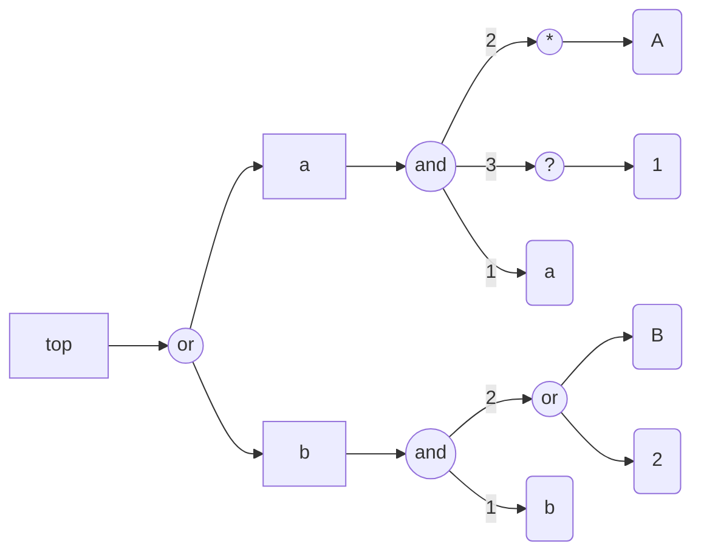
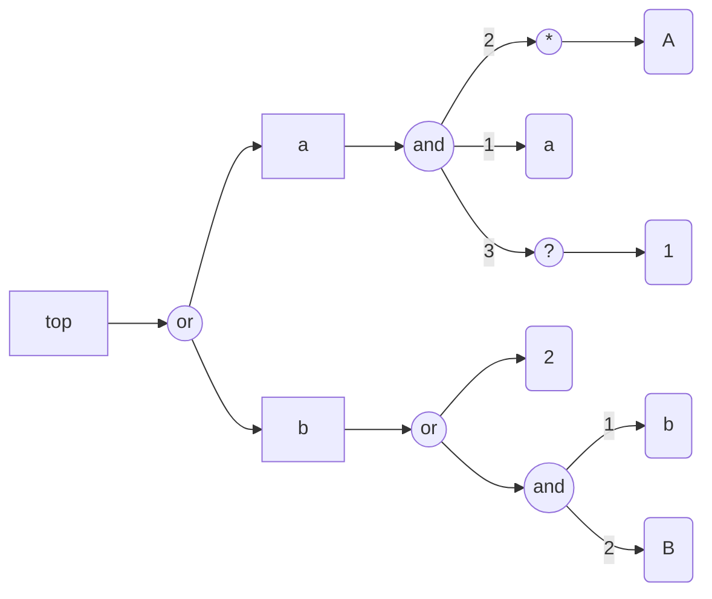
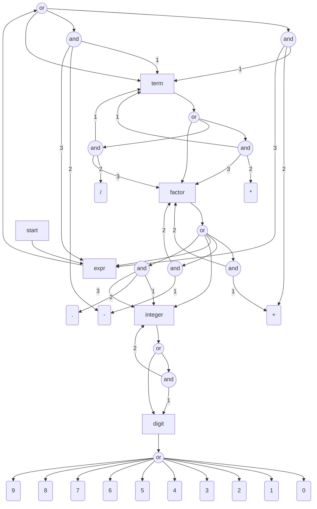
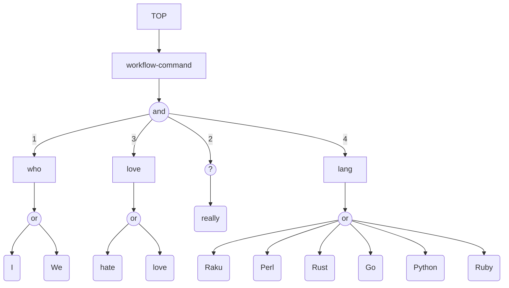

# Graph representation of grammars

## Introduction

```perl6
use FunctionalParsers;
use FunctionalParsers::EBNF;
use EBNF::Grammar;
use Grammar::TokenProcessing;
```
```
# (Any)
```

------

## Generating Mermaid diagrams for EBNFs

The function `fp-ebnf-parse` can produce
[Mermaid-JS diagrams](https://mermaid.js.org)
corresponding to grammars with the target "MermaidJS::Graph".
Here is an example:

```perl6, result=asis, output-lang=mermaid, output-prompt=NONE
my $ebnfCode3 = q:to/END/;
<top> = <a> | <b> ;
<a> = 'a' , { 'A' } , [ '1' ];
<b> = 'b' , ( 'B' | '2' );
END

fp-ebnf-parse($ebnfCode3, target=>'MermaidJS::Graph', dir-spec => 'LR').head.tail
```


Here is a legend:

- The non-terminals are shown with rectangles
- The terminals are shown with round rectangles
- The "conjunctions" are shown in disks

**Remark:** The Markdown cell above has the parameters `result=asis, output-lang=mermaid, output-prompt=NONE`
which allow for direct diagram rendering of the obtained Mermaid code in various Markdown viewers (GitHub, IntelliJ, etc.)

Compare the following EBNF grammar and corresponding diagram with the ones above:

```perl6, result=asis, output-lang=mermaid, output-prompt=NONE
my $ebnfCode4 = q:to/END/;
<top> = <a> | <b> ;
<a> = 'a' , { 'A' } , [ '1' ] ;
<b> = 'b' , 'B' | '2' ;
END

fp-ebnf-parse($ebnfCode4, target=>'MermaidJS::Graph', dir-spec => 'LR').head.tail
```


------

## More complicated grammar

Consider this grammar:

```perl6
my $ebnfExpr = q:to/END/;
start   = expr ;
expr    = term '+' expr | term '-' expr | term ;
term    = term '*' factor | term '/' factor | factor ;
factor  = '+' factor | '-' factor | (expr) | integer | integer '.' integer ;
integer = digit integer | digit ;
digit   = '0' | '1' | '2' | '3' | '4' | '5' | '6' | '7' | '8' | '9' ;
END
```
```
# start   = expr ;
# expr    = term '+' expr | term '-' expr | term ;
# term    = term '*' factor | term '/' factor | factor ;
# factor  = '+' factor | '-' factor | (expr) | integer | integer '.' integer ;
# integer = digit integer | digit ;
# digit   = '0' | '1' | '2' | '3' | '4' | '5' | '6' | '7' | '8' | '9' ;
```

Here we produce the graph using special parsing style:

```perl6, result=asis, output.lang=mermaid, output.prompt=NONE
fp-grammar-graph($ebnfExpr, style => 'Relaxed')
```


------

## Generating Mermaid diagrams for Raku grammars

In order to generate graphs for Raku grammars we use the following steps:

1. Translate Raku-grammar code into EBNF code
2. Translate EBNF code into graph code (Mermaid-JS or WL)

Consider a grammar for parsing integers:

```perl6
grammar LangLove {
    rule TOP  { <workflow-command> }
    rule workflow-command  { <who> 'really'? <love> <lang> }
    token who { 'I' | 'We' }
    token love { 'hate' | 'love' }
    token lang { 'Raku' | 'Perl' | 'Rust' | 'Go' | 'Python' | 'Ruby' }
}
```
```
# (LangLove)
```

Here is an example parsing:

```perl6
LangLove.parse('I hate Perl')
```
```
# ｢I hate Perl｣
#  workflow-command => ｢I hate Perl｣
#   who => ｢I｣
#   love => ｢hate｣
#   lang => ｢Perl｣
```

First we derive the corresponding EBNF grammar:

```perl6
my $ebnfLangLove = to-ebnf-grammar(LangLove)
```
```
# <TOP> = <workflow-command>  ;
# <lang> = 'Raku'  | 'Perl'  | 'Rust'  | 'Go'  | 'Python'  | 'Ruby'  ;
# <love> = 'hate'  | 'love'  ;
# <who> = 'I'  | 'We'  ;
# <workflow-command> = <who> , ['really'] , <love> , <lang>  ;
```

Here is the corresponding Mermaid-JS graph:

```perl6, result=asis, output.lang=mermaid, output.prompt=NONE
fp-grammar-graph($ebnfLangLove)
```
