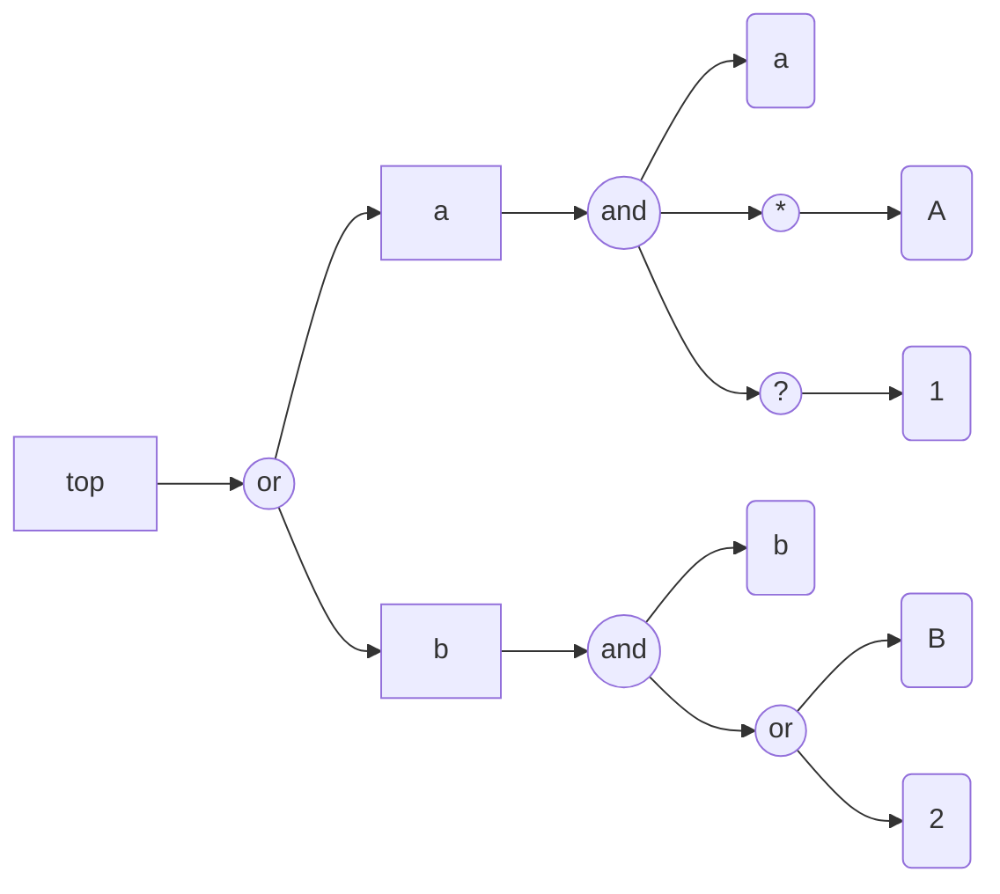
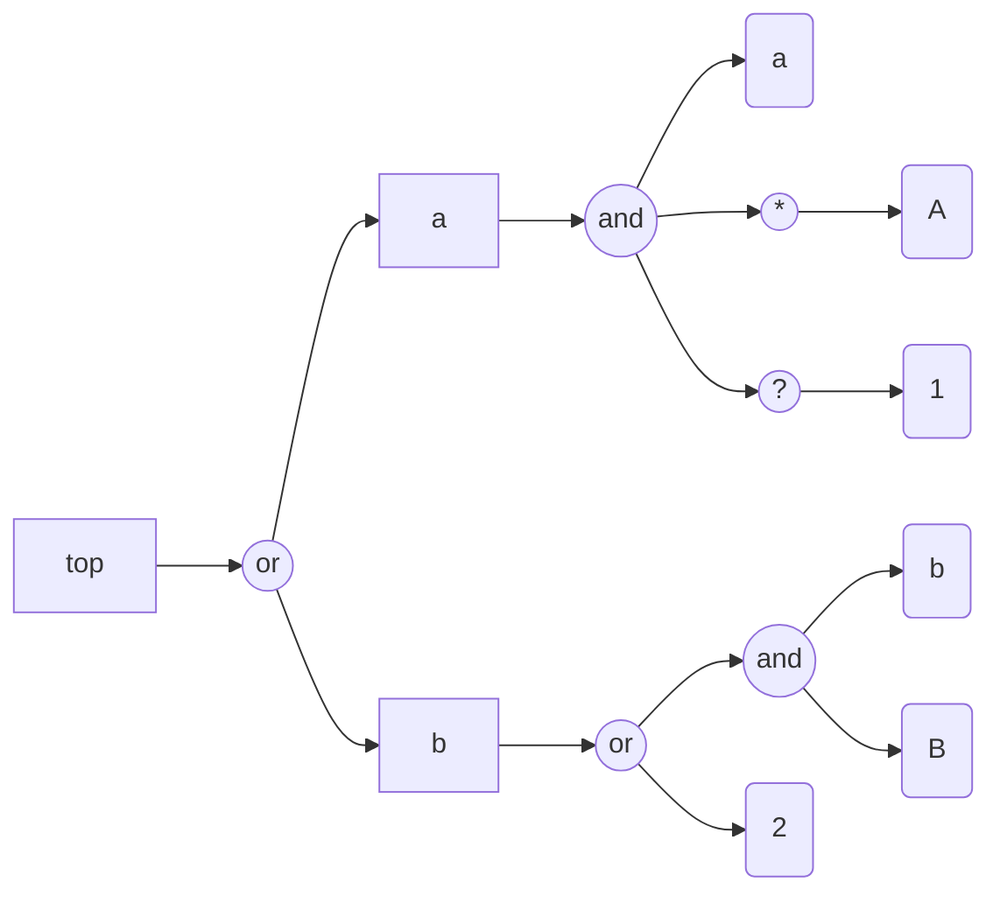

# Graph representation of grammars

## Introduction

```perl6
use FunctionalParsers;
use FunctionalParsers::EBNF;
use EBNF::Grammar;
use Grammar::TokenProcessing;
```
```
# (Any)
```

------

## Generating Mermaid diagrams for EBNFs

The function `fp-ebnf-parse` can produce
[Mermaid-JS diagrams](https://mermaid.js.org)
corresponding to grammars with the target "MermaidJS::Graph".
Here is an example:

```perl6, result=asis, output-lang=mermaid, output-prompt=NONE
my $ebnfCode3 = q:to/END/;
<top> = <a> | <b> ;
<a> = 'a' , { 'A' } , [ '1' ];
<b> = 'b' , ( 'B' | '2' );
END

fp-ebnf-parse($ebnfCode3, target=>'MermaidJS::Graph', dir-spec => 'LR').head.tail
```


Here is a legend:

- The non-terminals are shown with rectangles
- The terminals are shown with round rectangles
- The "conjunctions" are shown in disks

**Remark:** The Markdown cell above has the parameters `result=asis, output-lang=mermaid, output-prompt=NONE`
which allow for direct diagram rendering of the obtained Mermaid code in various Markdown viewers (GitHub, IntelliJ, etc.)

Compare the following EBNF grammar and corresponding diagram with the ones above:

```perl6, result=asis, output-lang=mermaid, output-prompt=NONE
my $ebnfCode4 = q:to/END/;
<top> = <a> | <b> ;
<a> = 'a' , { 'A' } , [ '1' ] ;
<b> = 'b' , 'B' | '2' ;
END

fp-ebnf-parse($ebnfCode4, target=>'MermaidJS::Graph', dir-spec => 'LR').head.tail
```

