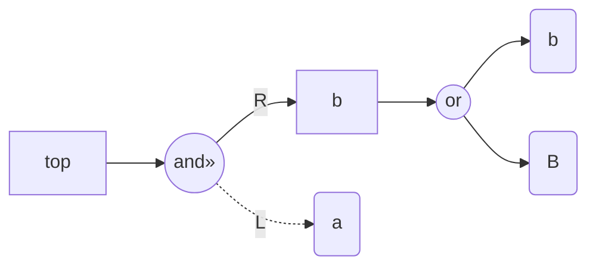
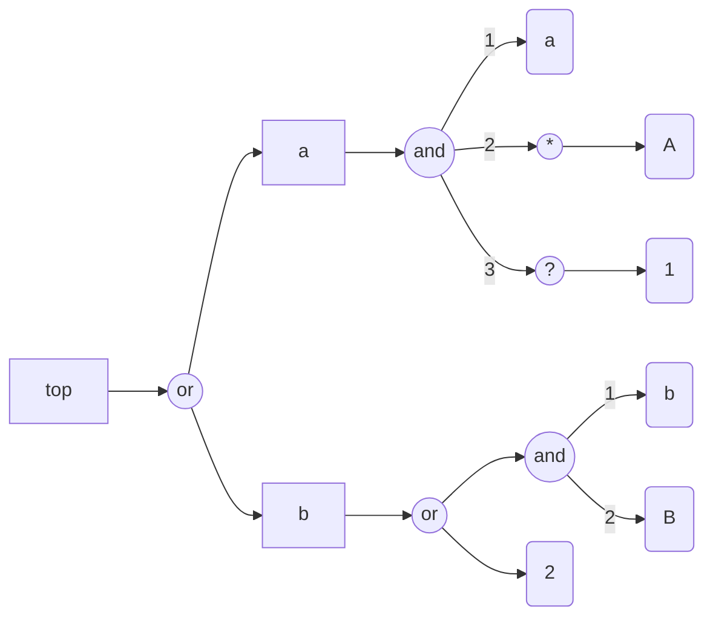
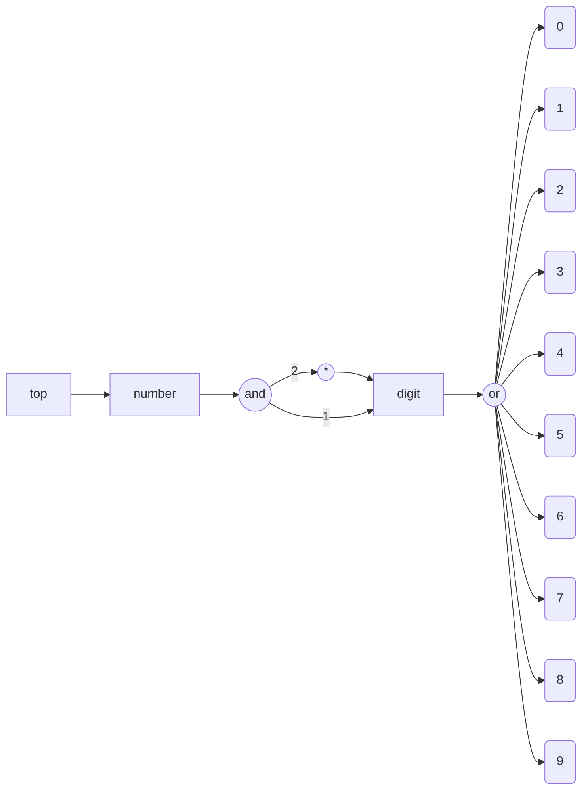
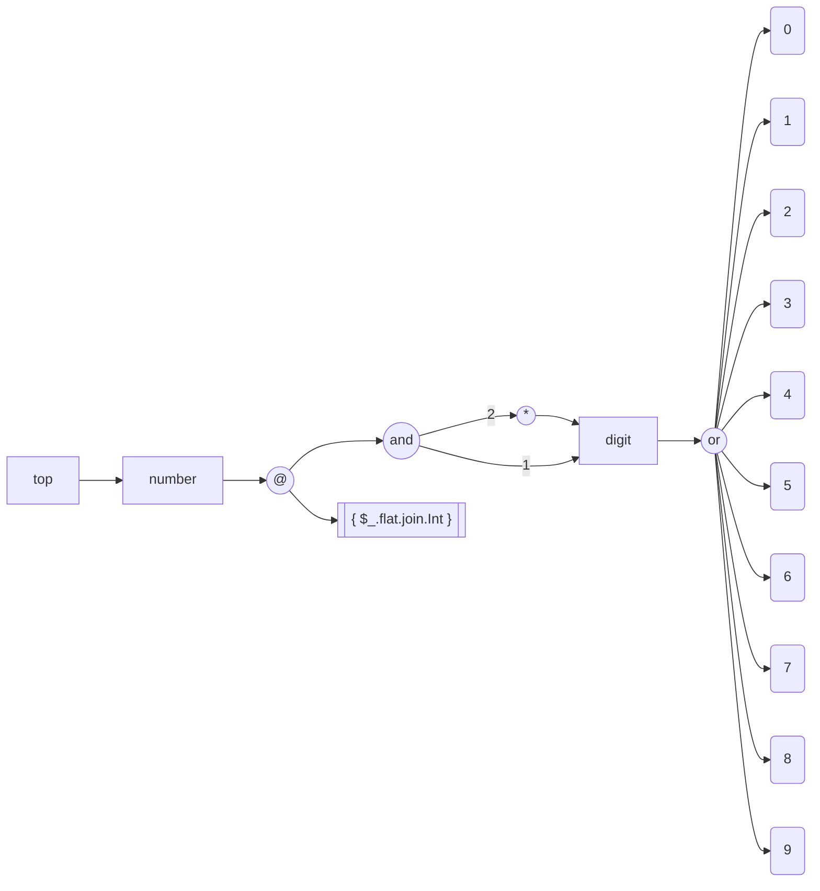
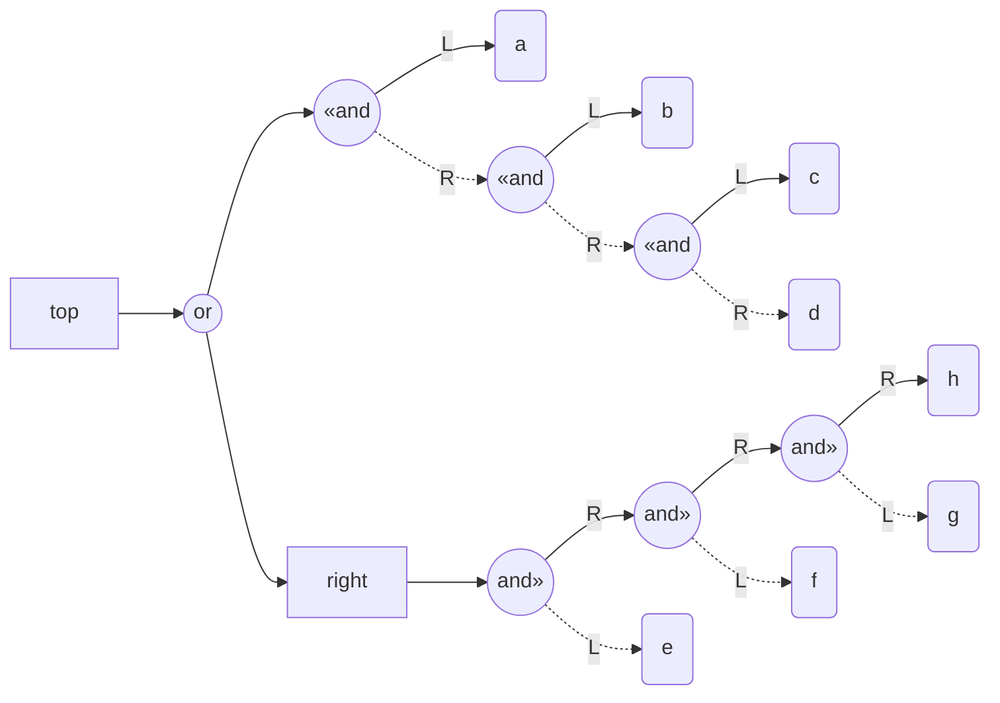
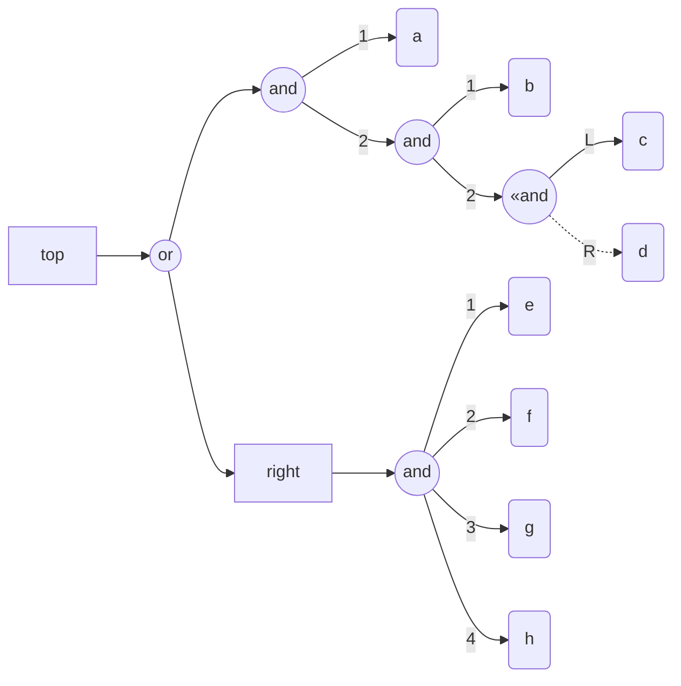

# Mermaid JS diagrams

## Introduction

This computational Markdown document is used for quick overview of the correctness (and quality)
of the Mermaid-JS diagrams.

```perl6

use FunctionalParsers::EBNF;
use FunctionalParsers::EBNF::Actions::MermaidJS::Graph;
```
```
# (Any)
```

------

## Simple examples

```perl6, result=asis, output.prompt=NONE, output.lang=mermaid
my $ebnf0 = q:to/END/;
<top> = 'a' &> <b> ;
<b> = 'b' | 'B' ;
END

fp-ebnf-parse($ebnf0, actions => 'MermaidJS::Graph', dir-spec => 'LR').head.tail;
```



```perl6, result=asis, output.prompt=NONE, output.lang=mermaid
my $ebnf1 = q:to/END/;
<top> = <a> | <b> ;
<a> = 'a' , { 'A' }, ['1'];
<b> = 'b' , 'B' | '2' ;
END

fp-ebnf-parse($ebnf1, actions => 'MermaidJS::Graph', dir-spec => 'LR').head.tail;
```


```perl6, result=asis, output.prompt=NONE, output.lang=mermaid
my $ebnf2 = q:to/END/;
<digit> = '0' | '1' | '2' | '3' | '4' | '5' | '6' | '7' | '8' | '9' ;
<number> ::= <digit> , { <digit> } ;
<top> = <number> ;
END

fp-ebnf-parse($ebnf2, actions => 'MermaidJS::Graph', dir-spec => 'LR').head.tail;
```


```perl6, result=asis, output.prompt=NONE, output.lang=mermaid
my $ebnf3 = q:to/END/;
<digit> = '0' | '1' | '2' | '3' | '4' | '5' | '6' | '7' | '8' | '9' ;
<number> ::= <digit> , { <digit> } <@ &{ $_.flat.join.Int } ;
<top> = <number> ;
END

fp-ebnf-parse($ebnf3, actions => 'MermaidJS::Graph', dir-spec => 'LR').head.tail;
```


```perl6, result=asis, output.prompt=NONE, output.lang=mermaid
my $ebnf4 = q:to/END/;
<top> = 'a' <& 'b' <& 'c' <& 'd' | <right> ;
<right> = 'e' &> 'f' &> 'g' &> 'h' ;
END

fp-ebnf-parse($ebnf4, actions => 'MermaidJS::Graph', dir-spec => 'LR').head.tail;
```



```perl6, result=asis, output.prompt=NONE, output.lang=mermaid
my $ebnf5 = q:to/END/;
<top> = 'a' , 'b' , 'c' <& 'd' | <right> ;
<right> = 'e' , 'f' , 'g' , 'h' ;
END

fp-ebnf-parse($ebnf5, actions => 'MermaidJS::Graph', dir-spec => 'LR').head.tail;
```
